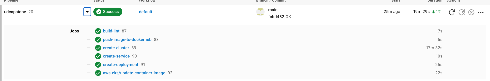
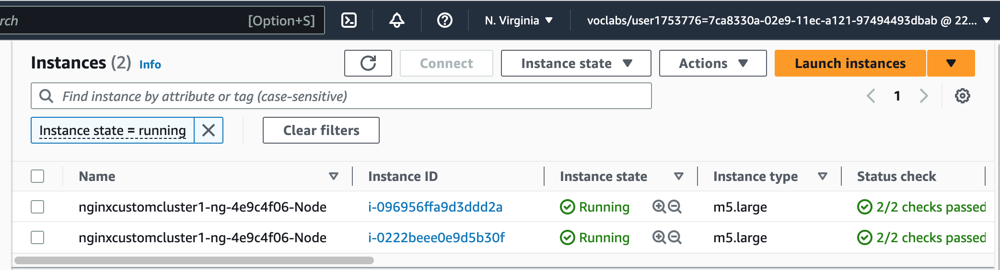
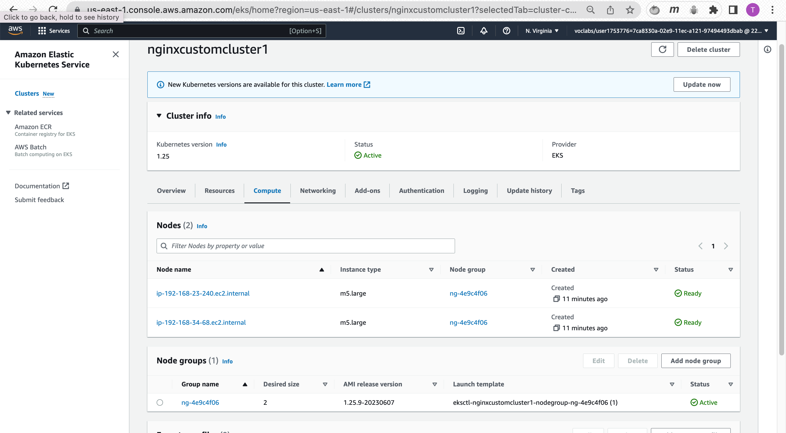
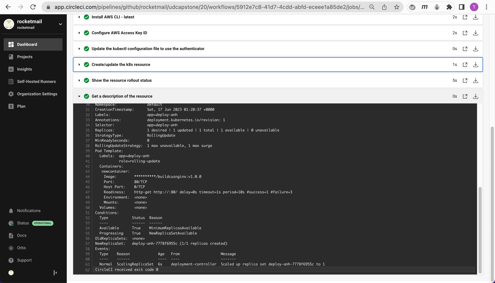
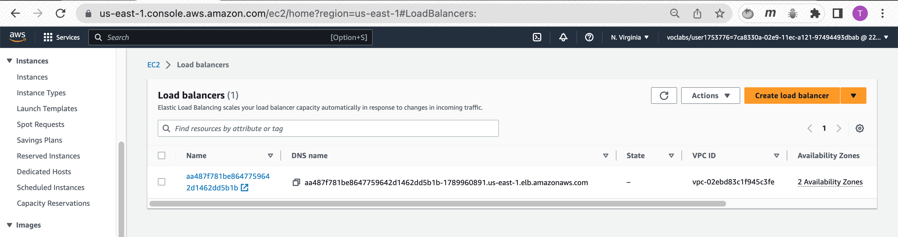
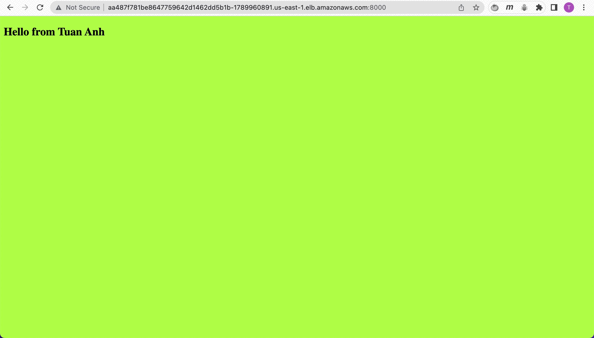

# udcapstone

1. Screenshot of the Circle CI or Jenkins pipeline showing all stages passed successfully(https://app.circleci.com/pipelines/github/rocketmail/udcapstone?branch=main)

2. Screenshot of your AWS EC2 page showing the newly created (for blue/green) or modified (for rolling) instances running as the EKS cluster nodes.

3. Screenshot of the kubectl command output showing that the deployment is successful, pods are running, and the service can be accessed via an external IP or port forwarding.

4. Screenshot showing that you can access the application after deployment.(http://aa487f781be8647759642d1462dd5b1b-1789960891.us-east-1.elb.amazonaws.com:8000)

